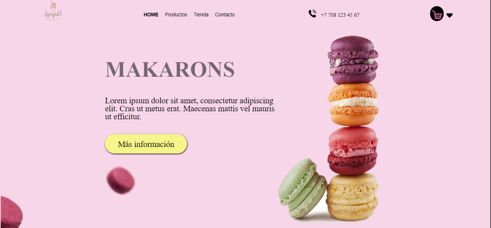
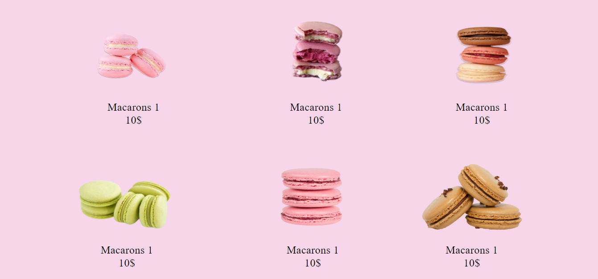

# Pagina web Makaron
En este sitio web se caracteriza por tener una interfaz muy atractiva y eso se logró gracias al buen uso de las buenas prácticas en CSS que en conjunto con HTML se pueden llegar a estos 
grandes resultados, por parte este más que un sitio web estos son retos que fui superando durante mi aprendizaje y que me ayudo a forjar una buena base en el manejo de estas tecnologías.

## Capturas

 |   |
| :---: | :---: |
|  |   |

## Tecnologías utilizadas

